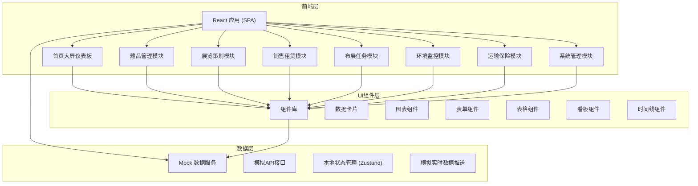
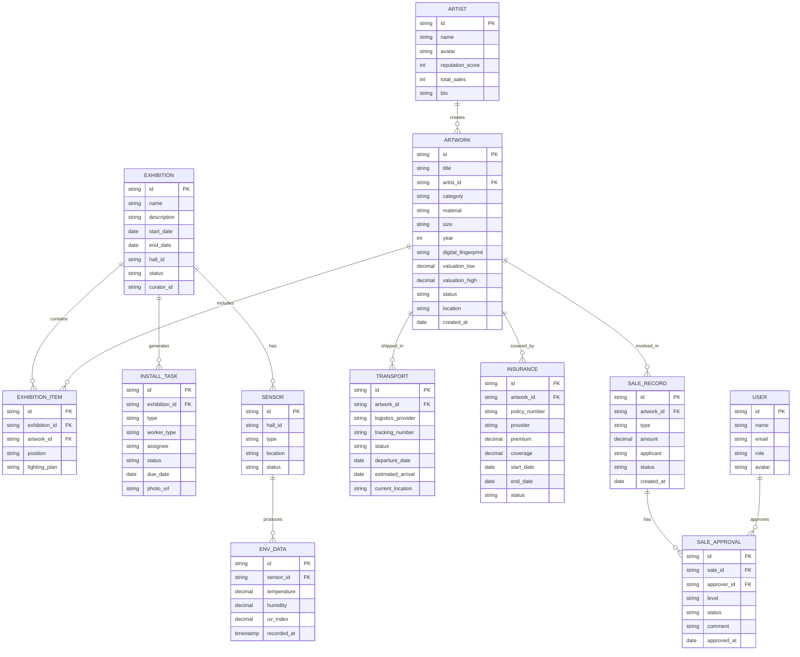

# 艺术品管理与展览调度平台 技术架构文档

## 1. 架构设计



## 2. 技术选型

- **前端框架**：React 18 + TypeScript
- **构建工具**：Vite 5
- **样式方案**：TailwindCSS 3 + CSS变量
- **路由管理**：React Router v6
- **状态管理**：Zustand（轻量级状态管理）
- **图表库**：Recharts（React图表库）
- **图标库**：Lucide React
- **UI组件**：自定义组件 + Headless UI
- **动画库**：Framer Motion
- **模拟数据**：MSW (Mock Service Worker) / 本地Mock数据

## 3. 路由定义

| 路由路径 | 页面名称 | 所属模块 |
|----------|----------|----------|
| `/` | 首页大屏 | 数据看板 |
| `/dashboard` | 首页大屏 | 数据看板 |
| `/collections` | 藏品列表 | 藏品管理 |
| `/collections/new` | 藏品入库 | 藏品管理 |
| `/collections/:id` | 藏品详情 | 藏品管理 |
| `/exhibitions` | 展览列表 | 展览策划 |
| `/exhibitions/new` | 创建展览 | 展览策划 |
| `/exhibitions/:id` | 展览详情 | 展览策划 |
| `/sales` | 销售租赁列表 | 销售租赁 |
| `/sales/new` | 新建申请 | 销售租赁 |
| `/sales/:id` | 申请详情/审批 | 销售租赁 |
| `/tasks` | 布展任务看板 | 布展任务 |
| `/tasks/:id` | 任务详情 | 布展任务 |
| `/environment` | 环境监控 | 环境监控 |
| `/logistics` | 运输保险 | 运输保险 |
| `/settings` | 系统设置 | 系统管理 |
| `/settings/users` | 用户管理 | 系统管理 |
| `/settings/valuation` | 估值规则 | 系统管理 |

## 4. 数据模型

### 4.1 数据模型ER图



### 4.2 核心数据类型定义

```typescript
// 用户与权限
type UserRole = 'artist' | 'curator' | 'keeper' | 'director';

interface User {
  id: string;
  name: string;
  email: string;
  role: UserRole;
  avatar: string;
}

// 艺术家
interface Artist {
  id: string;
  name: string;
  avatar: string;
  reputationScore: number;
  totalSales: number;
  bio: string;
}

// 艺术品
type ArtworkStatus = 'in_storage' | 'on_exhibition' | 'on_loan' | 'in_transport' | 'sold';

interface Artwork {
  id: string;
  title: string;
  artistId: string;
  artistName: string;
  category: string;
  material: string;
  size: { width: number; height: number; depth?: number; unit: string };
  year: number;
  imageUrl: string;
  digitalFingerprint: string;
  valuation: {
    low: number;
    high: number;
    lastUpdated: string;
  };
  status: ArtworkStatus;
  location: string;
  createdAt: string;
  exhibitionHistory: string[];
}

// 展览
type ExhibitionStatus = 'draft' | 'planned' | 'installing' | 'ongoing' | 'closed';

interface Exhibition {
  id: string;
  name: string;
  description: string;
  startDate: string;
  endDate: string;
  hallId: string;
  hallName: string;
  status: ExhibitionStatus;
  curatorId: string;
  curatorName: string;
  artworks: ExhibitionArtwork[];
  visitorCount?: number;
  layoutPlan?: LayoutPlan;
}

interface ExhibitionArtwork {
  artworkId: string;
  artworkTitle: string;
  position: { x: number; y: number };
  lightingPlan: LightingRecommendation;
  conflictDetected?: boolean;
  conflictReason?: string;
}

interface LightingRecommendation {
  intensity: string;
  colorTemperature: string;
  uvProtection: boolean;
  humidityControl: string;
}

interface LayoutPlan {
  hallDimensions: { width: number; height: number };
  recommendedLayout: string;
  conflictWarnings: string[];
}

// 销售/租赁
type SaleType = 'sale' | 'rental';
type SaleStatus = 'pending' | 'director_approved' | 'committee_approved' | 'financial_approved' | 'approved' | 'rejected' | 'overdue_escalated';
type ApprovalLevel = 'director' | 'committee' | 'financial';

interface SaleRecord {
  id: string;
  artworkId: string;
  artworkTitle: string;
  artistName: string;
  type: SaleType;
  amount: number;
  applicant: string;
  applicantContact: string;
  status: SaleStatus;
  createdAt: string;
  rentalPeriod?: { start: string; end: string };
  approvals: Approval[];
  currentLevel: ApprovalLevel;
  escalated: boolean;
  lastUpdate: string;
}

interface Approval {
  level: ApprovalLevel;
  approverId?: string;
  approverName?: string;
  status: 'pending' | 'approved' | 'rejected' | 'escalated';
  comment?: string;
  timestamp?: string;
}

// 布展任务
type TaskType = 'installation' | 'lighting' | 'packaging' | 'transportation' | 'security';
type TaskStatus = 'pending' | 'assigned' | 'in_progress' | 'completed' | 'delayed';

interface InstallTask {
  id: string;
  exhibitionId: string;
  exhibitionName: string;
  title: string;
  type: TaskType;
  workerType: string;
  assignee?: string;
  status: TaskStatus;
  dueDate: string;
  completedAt?: string;
  photoUrl?: string;
  description: string;
  priority: 'low' | 'medium' | 'high';
}

// 环境监控
interface Sensor {
  id: string;
  hallId: string;
  hallName: string;
  type: string;
  location: string;
  status: 'normal' | 'warning' | 'error';
  currentData: SensorData;
}

interface SensorData {
  temperature: number;
  humidity: number;
  uvIndex: number;
  timestamp: string;
}

interface Thresholds {
  temperature: { min: number; max: number };
  humidity: { min: number; max: number };
  uvIndex: { max: number };
}

interface Alert {
  id: string;
  sensorId: string;
  hallName: string;
  type: string;
  level: 'warning' | 'critical' | 'escalated';
  message: string;
  value: number;
  threshold: number;
  startTime: string;
  resolvedAt?: string;
  workOrderId?: string;
}

interface WorkOrder {
  id: string;
  alertId: string;
  type: string;
  status: 'open' | 'in_progress' | 'resolved';
  assignee: string;
  createdAt: string;
  resolvedAt?: string;
}

// 运输保险
type TransportStatus = 'pending' | 'in_transit' | 'delayed' | 'delivered';

interface Transport {
  id: string;
  artworkId: string;
  artworkTitle: string;
  provider: string;
  trackingNumber: string;
  status: TransportStatus;
  departureDate: string;
  estimatedArrival: string;
  currentLocation: string;
  route: TransportNode[];
  insuranceId: string;
  recommendedPlan?: LogisticsPlan;
}

interface TransportNode {
  location: string;
  timestamp: string;
  status: string;
}

interface LogisticsPlan {
  provider: string;
  estimatedCost: number;
  duration: string;
  insuranceCoverage: number;
  recommendationReason: string;
}

type InsuranceStatus = 'active' | 'expiring_soon' | 'expired';

interface Insurance {
  id: string;
  artworkId: string;
  artworkTitle: string;
  policyNumber: string;
  provider: string;
  premium: number;
  coverage: number;
  startDate: string;
  endDate: string;
  status: InsuranceStatus;
  renewalPending: boolean;
}

// 首页数据
interface DashboardData {
  overview: {
    totalArtworks: number;
    activeExhibitions: number;
    inTransit: number;
    totalValue: number;
  };
  halls: HallData[];
  environment: EnvironmentSummary;
  installations: InstallationProgress[];
  logistics: TransportSummary[];
  recentAlerts: Alert[];
}

interface HallData {
  hallId: string;
  hallName: string;
  currentExhibition: string;
  visitorCount: number;
  heatIndex: number;
  envStatus: 'normal' | 'warning';
}

interface EnvironmentSummary {
  overallCompliance: number;
  normalHalls: number;
  warningHalls: number;
  alertsToday: number;
}

interface InstallationProgress {
  exhibitionId: string;
  exhibitionName: string;
  progress: number;
  totalTasks: number;
  completedTasks: number;
  dueDate: string;
}

interface TransportSummary {
  transportId: string;
  artworkTitle: string;
  status: TransportStatus;
  currentLocation: string;
  estimatedArrival: string;
}

// 估值规则
interface ValuationRules {
  artistReputationWeight: number;
  salesHistoryWeight: number;
  marketTrendWeight: number;
  materialMultiplier: Record<string, number>;
  categoryMultiplier: Record<string, number>;
  autoValuationEnabled: boolean;
}
```

## 5. 目录结构

```
src/
├── assets/           # 静态资源
├── components/       # 通用组件
│   ├── ui/          # 基础UI组件
│   ├── charts/      # 图表组件
│   ├── layout/      # 布局组件
│   └── common/      # 业务通用组件
├── pages/           # 页面组件
│   ├── Dashboard/   # 首页大屏
│   ├── Collections/ # 藏品管理
│   ├── Exhibitions/ # 展览策划
│   ├── Sales/       # 销售租赁
│   ├── Tasks/       # 布展任务
│   ├── Environment/ # 环境监控
│   ├── Logistics/   # 运输保险
│   └── Settings/    # 系统设置
├── store/           # 状态管理
├── data/            # Mock数据
├── hooks/           # 自定义Hooks
├── utils/           # 工具函数
├── types/           # TypeScript类型定义
├── App.tsx
├── main.tsx
└── index.css
```

## 6. 核心技术实现

### 6.1 实时数据刷新机制

- 使用 `setInterval` 模拟每5秒数据刷新
- 首页数据采用增量更新策略
- 数据变化时使用动画过渡效果（数字滚动、进度条渐变）

### 6.2 权限控制

- 基于角色的路由守卫
- 组件级权限控制（自定义Hook `usePermission`）
- 菜单动态渲染

### 6.3 智能推荐算法（模拟）

- 布展方案：基于作品材质、尺寸与展厅参数的匹配算法
- 价值预估：艺术家声望 + 成交记录 + 市场趋势加权计算
- 物流推荐：基于尺寸、价值、时效需求的多维度评分

### 6.4 审批流程引擎

- 三级审批状态机
- 超时越级检测（基于时间戳计算）
- 审批历史时间线展示

### 6.5 动画与交互

- 页面入场：Framer Motion 分步淡入
- 数据变化：数字滚动、进度条平滑过渡
- 告警状态：脉冲闪烁动画
- 卡片交互：悬停微上浮、边框发光
